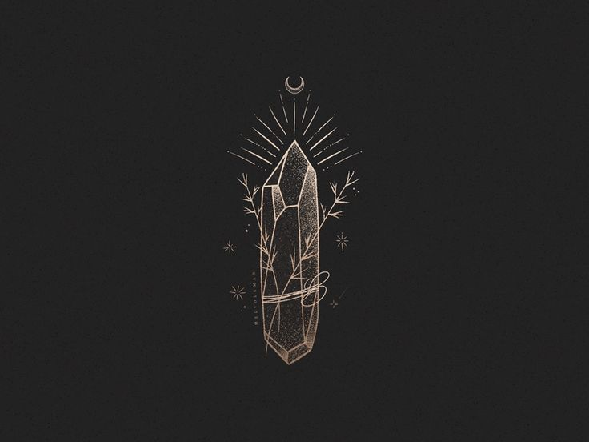

# gosaliya_sahil_portfolio
This is a portfolio site project

# description
This is a professional portfolio Site.
It includes skills, projects and other details about myself as a front-end-dev.
It is built in html,css (a new additionality called Sass.css is also implemented) and JS as of now.
It is a harry potter theme based portfolio where you will see many magical thing happening.

# future 
Additional magical mouse pointer with more user friendly responsive site which will have case studies and dynamic content.

# version / history
1. - layout with grid system 
2. - Content Loaded with CSS and JS
3. - Coming soong with Backend

# how to use
1. Clone the repo / Download the files
2. Load it in your system
3. Run it and have fun

# functionality
Use your mouse or touch pad as it is responsive website. 

# contributing
Sahilkumar Gosaliya - Student at Fanshawe

# Credits
The photos and images used in the website were sourced from the royalty stocks, orignal harry potter / WB site.

# license
MIT
